# Generative Deep Learning using Keras

This is a repo where I played with Variational AutoEncoders (VAE)

## Datasets: 

- Large Scale CelebFaces Attributes [CelebA](http://mmlab.ie.cuhk.edu.hk/projects/CelebA.html)
- [Google Quick! Draw! Dataset] (https://github.com/googlecreativelab/quickdraw-dataset)

## Examples :

### Random faces generated using a VAE:
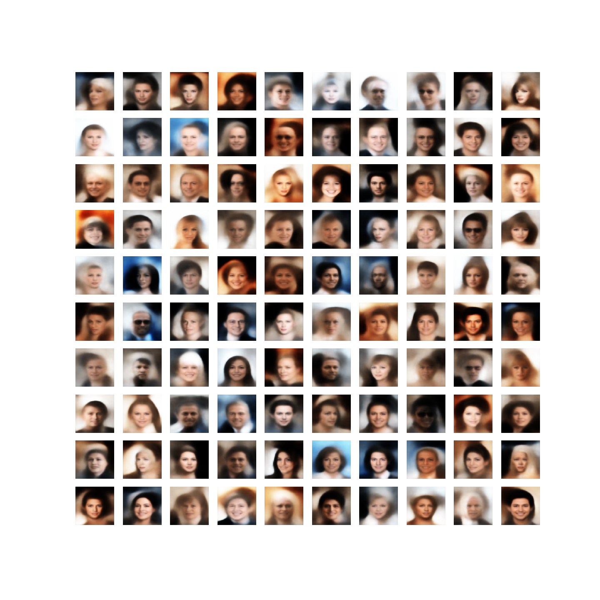
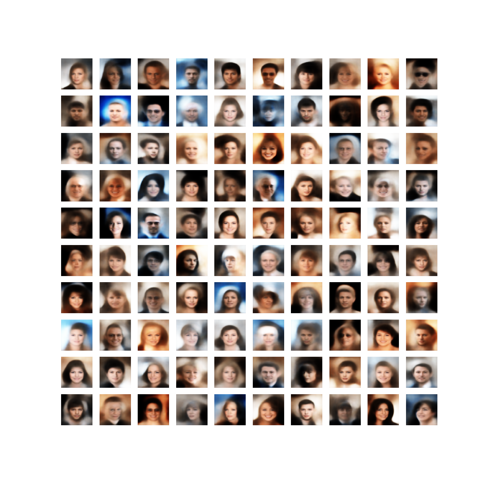
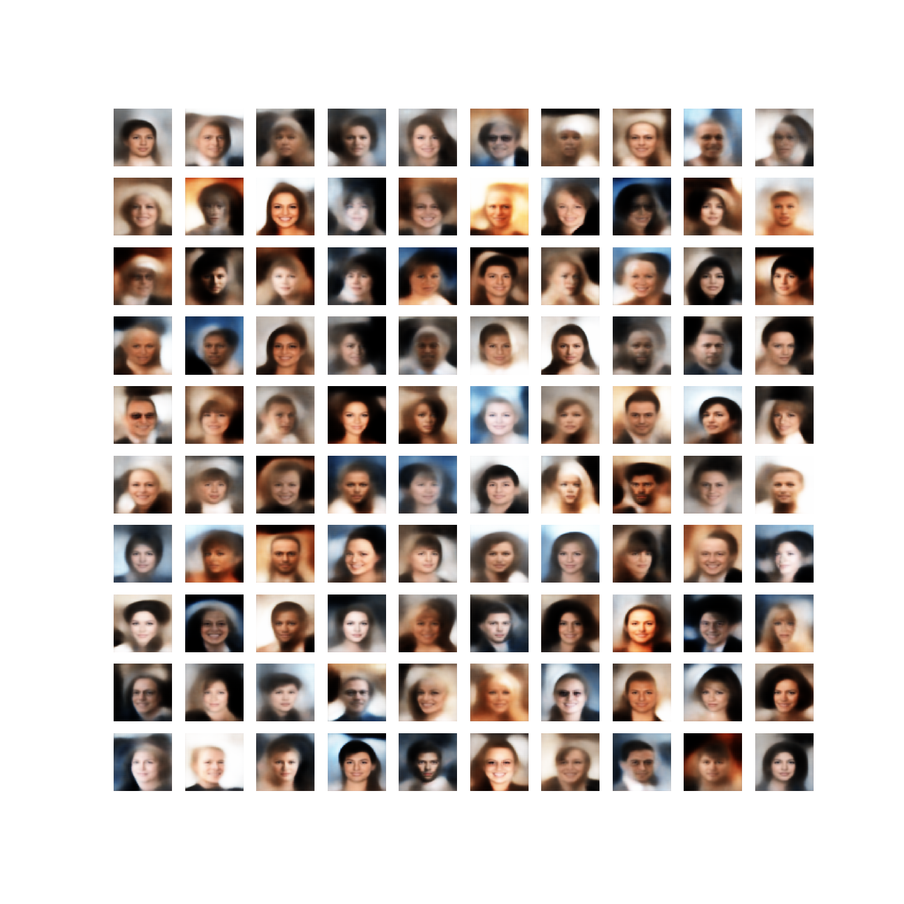
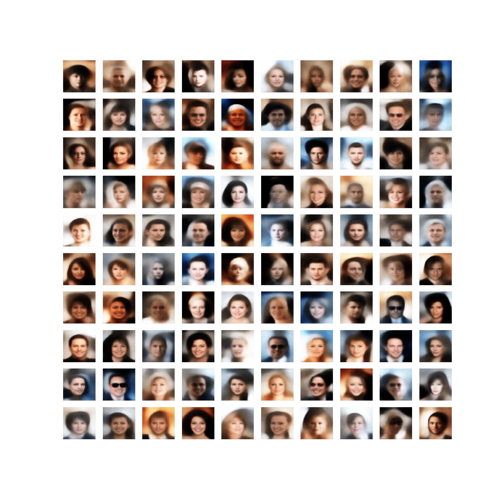
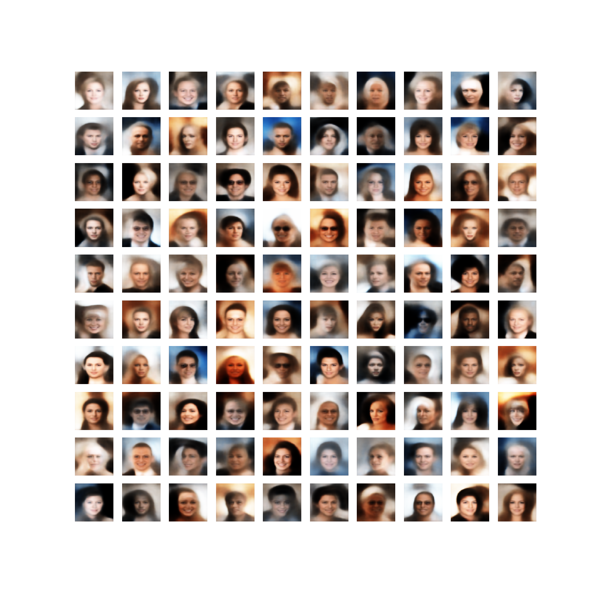

### Adding attributes to an image 

Smiling
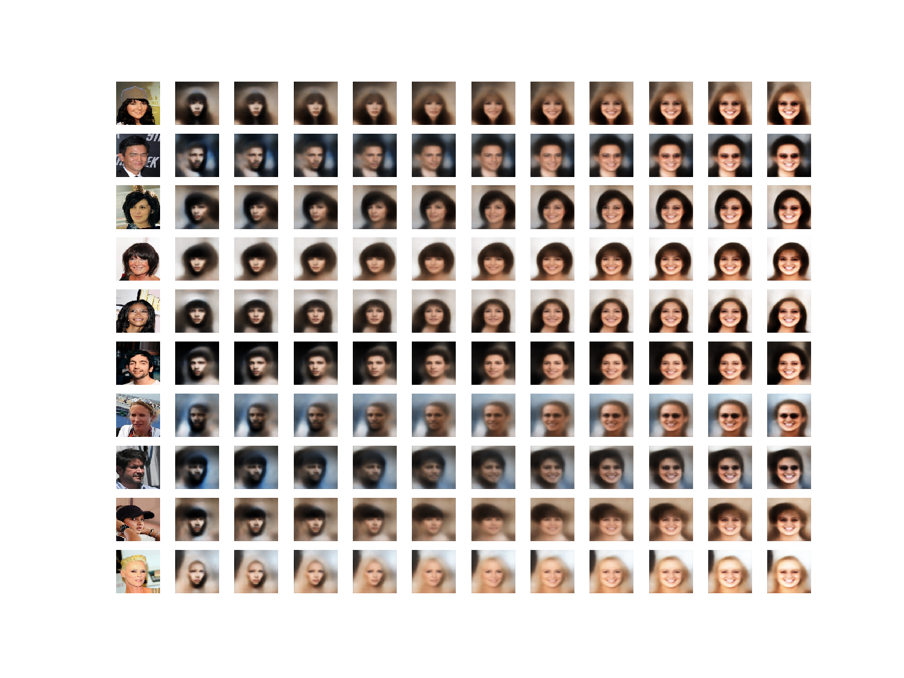

Bangs
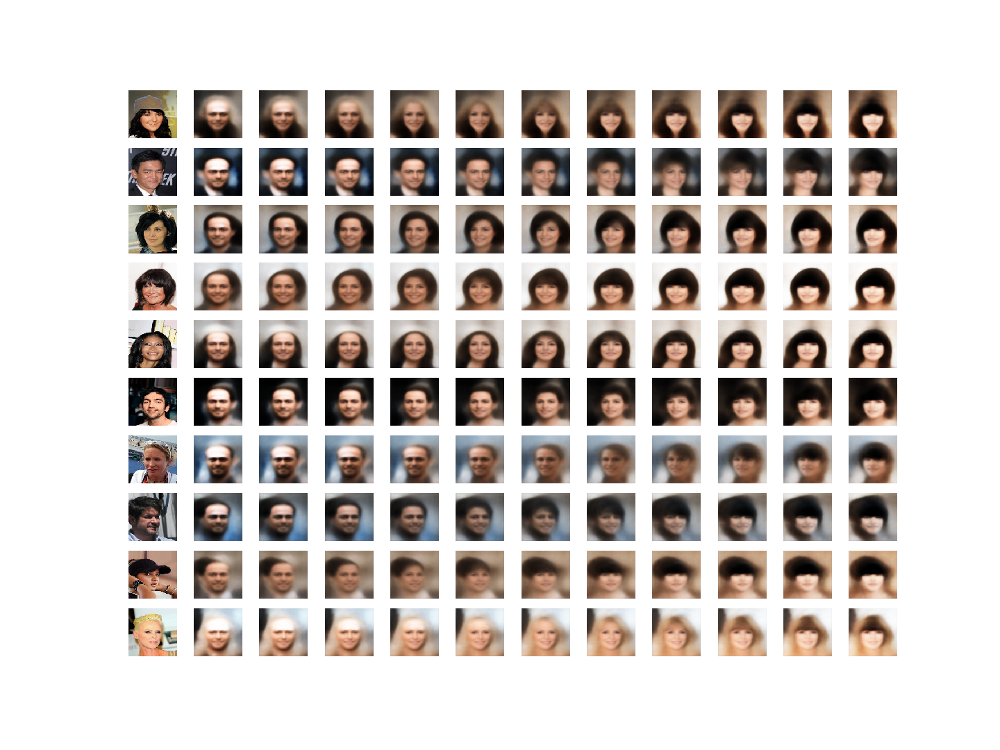

Blond Hair
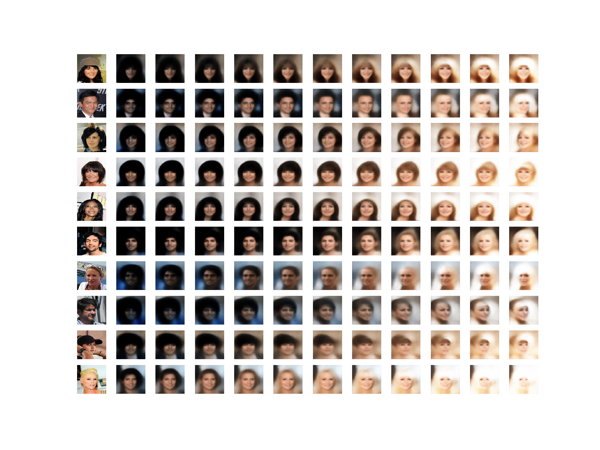

Eyeglasses
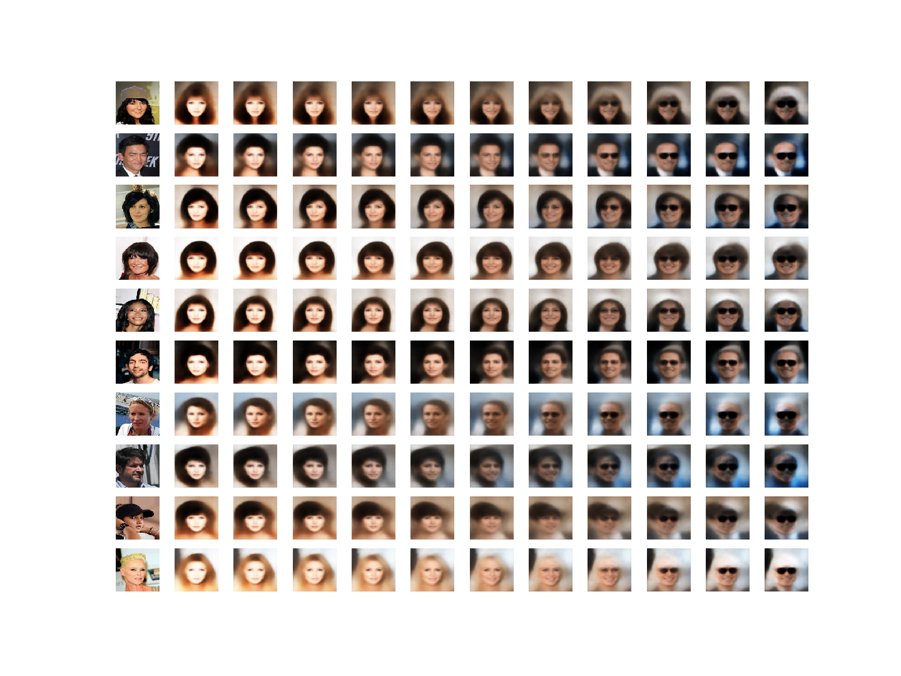

Gray Hair
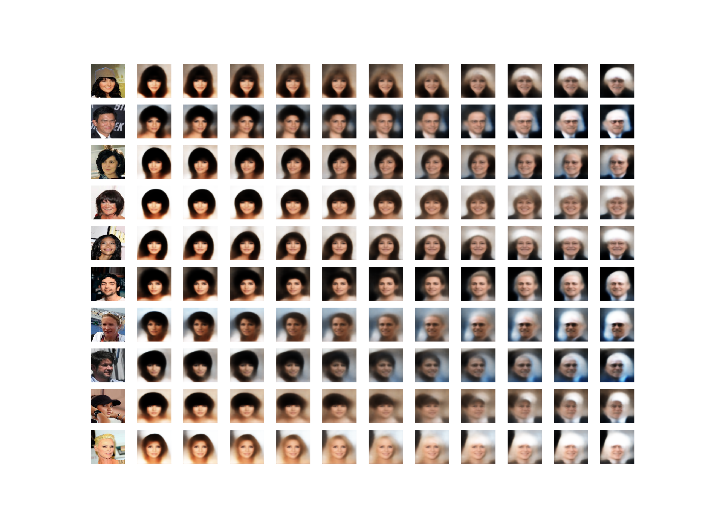

## Reconstructing an encoded face
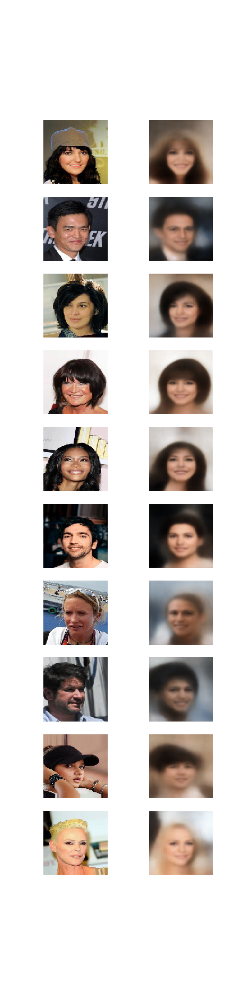

## Generating Skulls

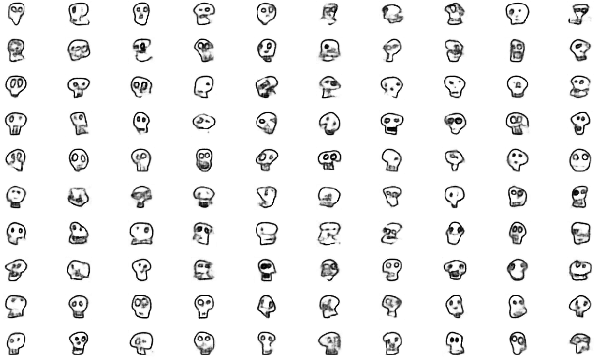

## Generating Firetrucks (for my twins)

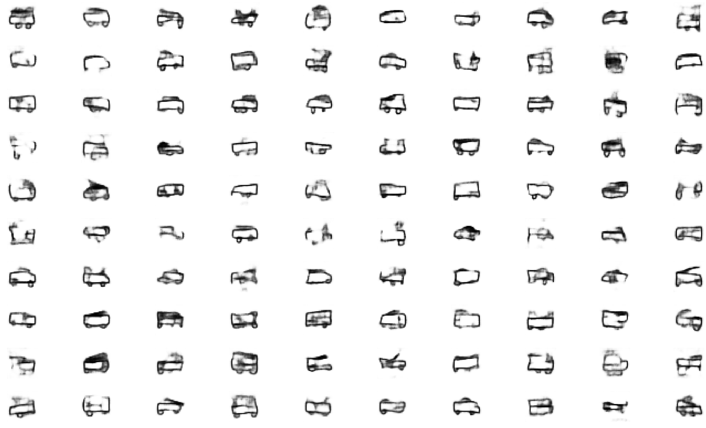